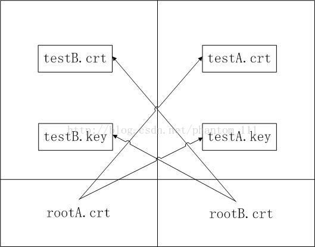

[Go-gRPC 实践指南](https://github.com/jergoo/go-grpc-practice-guide)

[代码](https://github.com/jergoo/go-grpc-example)

[gRPC-transport包源码分析](https://blog.csdn.net/phantom_111/article/details/76688252)
https://www.jianshu.com/p/d84e2be4c52c

[gRPC-Go服务端源码分析](https://feilengcui008.github.io/post/grpc-go%E6%9C%8D%E5%8A%A1%E7%AB%AF%E6%BA%90%E7%A0%81%E5%88%86%E6%9E%90/)

[Go接口详解](https://feilengcui008.github.io/post/go%E6%8E%A5%E5%8F%A3%E8%AF%A6%E8%A7%A3/)

[gRPC-Go客户端源码分析](https://feilengcui008.github.io/post/grpc-go%E5%AE%A2%E6%88%B7%E7%AB%AF%E6%BA%90%E7%A0%81%E5%88%86%E6%9E%90/)


[gRPC 内容介绍](https://blog.csdn.net/phantom_111/article/details/74356739) 

[Go Channel 应用模式](http://colobu.com/2018/03/26/channel-patterns/)

[Go网络开发中的两个技术点](http://colobu.com/2018/03/08/two-issues-in-go-development/)

[go addressable 详解](http://colobu.com/2018/02/27/go-addressable/)

[golang版本grpc服务端浅析](https://guidao.github.io/grpc_server.html)

[详解 HTTP/2 Server Push——进一步提升页面加载速度](http://geek.csdn.net/news/detail/208615)

[深入了解 gRPC：协议](https://www.jianshu.com/u/1yJ3ge)


## grpc 双向验证

参考: https://blog.csdn.net/phantom_111/article/details/78797502

笔者在自己的项目中使用grpc的双向验证功能，此处使用的证书均为笔者自签获取。笔者的双向验证流程如下所示：

1. rootB.crt作为根证书签发testB.crt的二级证书
2. rootA.crt作为根证书签发testA.crt的二级证书

**注意： testB.key和testA.key保存用户的私钥不会再网络上传输，笔者在理解双向验证时，是基于HTTPS的单向验证进行理解的。**

**HTTPS的单向验证理解：**

1. 浏览器会先预先植入一些可信网站的根证书，用户也可自行下载可信网站的根证书。
2. 浏览器在使用https连接server端服务时，server端会首先将证书通过网络传输发送到浏览器（客户端）。
3. 浏览器（客户端）在接收到server的证书后，验证server端的证书是否为自己签发的子证书。



#### client端双向验证代码

```go
certificate, err := tls.LoadX509KeyPair(config.SelfCertFile, config.SelfKeyFile)
if err != nil {
    log.Fatalf("load x509 key pair failed: %s", err)
}
certPool := x509.NewCertPool()
bs, err := ioutil.ReadFile(config.RootCAFile)
if err != nil {
    log.Fatalf("fail to read ca cert: %s", err)
}
ok := certPool.AppendCertsFromPEM(bs)
if !ok {
    log.Fatal("failed to append certs")
}

transportCreds := credentials.NewTLS(&tls.Config{  //核心产生一个传输通道的证书
    ServerName:   config.ServerName,
    Certificates: []tls.Certificate{certificate},
    RootCAs:      certPool,
})
dialOption := grpc.WithTransportCredentials(transportCreds) //配置一个连接层的安全证书
grpcConn, err := grpc.Dial(grpcAddress, dialOption) //与grpc的server端建立连接
if err != nil {
    log.WithError(err).Fatal("[NewReviewClient] create grpc conn failed")
}
...
```

主要使用的函数：`func WithTransportCredentials(creds credentials.TransportCredentials) DialOption`    

grpc还提供针对每个连接的访问授权  `WithPerRPCCredentials()`

#### Server端的双向验证代码

```go
caCert, err := ioutil.ReadFile(remoteCAFile)
if err != nil {
    log.WithError(err).Fatal("Fail to load client root ca certs")
}
caCertPool := x509.NewCertPool()
ok := caCertPool.AppendCertsFromPEM(caCert)
if !ok {
    log.Fatal("Failed to append client certs")
}

certificate, err := tls.LoadX509KeyPair(localCrtFile, localKeyFile)

tlsConfig := &tls.Config{
    ClientAuth:   tls.RequireAndVerifyClientCert,
    Certificates: []tls.Certificate{certificate},
    ClientCAs:    caCertPool,
}

svrOption :=  grpc.Creds(credentials.NewTLS(tlsConfig)) 
//Creds函数返回一个已经包含证书的server端连接ServerOption结构
...
```

主要使用的函数：`func Creds(c credentials.TransportCredentials) ServerOption`